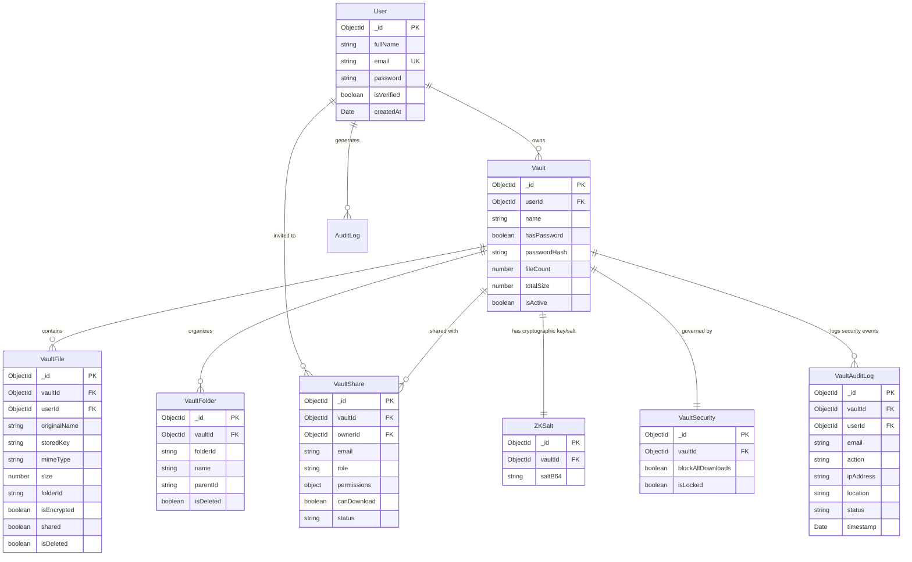

# AirVault

**AirVault** is a Zero-Knowledge Encrypted File Vault and secure multi-user collaboration platform built using browser-native **AES-GCM 256-bit client-side encryption**, granular per-member Role-Based Access Control (RBAC), geo-aware security audit tracking, and **Cloudflare R2** zero-egress object storage.

---

## Table of Contents

1. [Problem Statement](#1-problem-statement)
2. [User Personas & Pain Points](#2-user-personas--pain-points)
3. [What I Built & System Architecture](#3-what-i-built--system-architecture)
4. [Tech Stack & Technical Tradeoffs](#4-tech-stack--technical-tradeoffs)
5. [Database Architecture & Production Queries](#5-database-architecture--production-queries)
6. [Real-World Engineering Challenges](#6-real-world-engineering-challenges)
7. [Outcomes, Impact & Key Learnings](#7-outcomes-impact--key-learnings)
8. [API Reference & Security Model](#8-api-reference--security-model)
9. [Environment Variables & Setup](#9-environment-variables--setup)

---

## 1. Problem Statement

### The Core Problem
Modern cloud storage providers (Google Drive, Dropbox, OneDrive) operate on a **trusted-server model**. Files uploaded to their infrastructure are encrypted *after* reaching their servers using keys owned and managed by the cloud vendor. This centralized model creates single points of failure:
- **Server-Side Data Breaches**: Cloud infrastructure compromises expose plaintext files.
- **Insider Threat & Subpoenas**: Third parties with database access can inspect raw user documents without user knowledge.
- **Lack of Granular File Sovereignty**: Standard cloud platforms offer simple link sharing with binary permissions (Editor vs Viewer), lacking micro-toggles such as *preventing downloads while permitting in-browser previews*.

### The Cryptographic Usability Gap
Conversely, traditional End-to-End Encryption (E2EE) tools (like PGP or raw GPG CLI utilities) suffer from severe usability friction:
- Heavy manual RSA key management and public key handshakes.
- Inability to support multi-user team collaboration or role delegation.
- Lack of real-time audit visibility (IP, device, geo-location tracking per file access).
- Prohibitive bandwidth egress charges when serving large encrypted media over standard cloud pipelines.

### The Solution: AirVault
AirVault solves this problem by executing **Zero-Knowledge client-side encryption** inside the user's browser before any file payload touches the wire. The backend server acts strictly as an encrypted blob coordinator and authorization engine, never receiving plaintext file data. Coupled with zero-egress Cloudflare R2 storage, granular team RBAC, and real-time security logging, AirVault delivers enterprise security with consumer-grade UI/UX.

---

## 2. User Personas & Pain Points

Before defining features, AirVault was architected around three core user personas:

```
┌─────────────────────────────────────────────────────────────────────────┐
│                           AIRVAULT TARGET USERS                         │
├───────────────────────────┬───────────────────────────┬─────────────────┤
│ Security-Conscious Teams  │ Digital Creators &        │ Personal Power  │
│ & Enterprise Operations   │ Freelancers               │ Users           │
└───────────────────────────┴───────────────────────────┴─────────────────┘
```

### User Persona 1: Security-Conscious Teams & Enterprise Operations
- **Who They Are**: Operations managers, legal counsel, and startup founders sharing sensitive financial records, legal contracts, API credentials, and identity documents across team members.
- **Why They Need It**: They must collaborate on confidential files across internal employees and external contractors without trusting cloud storage providers with raw data.
- **Key Pain Point**: Existing cloud drives grant all-or-nothing file access. Once a file is accessible, members can download and redistribute raw bytes. Teams lack the ability to allow in-browser viewing while strictly enforcing a **Block All Downloads** policy across non-owner roles.

### User Persona 2: Digital Creators & Independent Freelancers
- **Who They Are**: Video producers, graphic designers, and software consultants delivering client work.
- **Why They Need It**: They need to share heavy digital deliverables (video cuts, high-res designs) with clients for review before final payment.
- **Key Pain Point**: Standard cloud providers charge high egress bandwidth fees on large asset downloads. Furthermore, public share links are prone to unauthorized secondary distribution. Creators need file-level temporary public sharing with automated key management and zero egress penalties.

### User Persona 3: Individual Power Users
- **Who They Are**: Privacy-focused individuals storing sensitive personal assets (tax filings, medical records, passphrases, seed backups).
- **Why They Need It**: They demand total cryptographic control over their personal archives without relying on centralized SaaS vendor trust.
- **Key Pain Point**: Existing E2EE utilities (GPG, Cryptomator) lack cross-device accessibility, mobile-friendly Web interfaces, folder hierarchies, and passwordless fallback modes for non-technical users.

---

## 3. What I Built & System Architecture

### High-Level System Architecture

AirVault separates data storage, metadata indexing, and cryptographic key derivation into distinct, decoupled layers:

```
┌─────────────────────────────────────────────────────────────────────────────┐
│                              CLIENT BROWSER                                 │
│                                                                             │
│   React 19 SPA   ───►  ZKcrypto.js (Web Crypto API)  ───►  vaultApi.js      │
│                            │ (AES-GCM / PBKDF2)             │               │
└────────────────────────────┼────────────────────────────────┼───────────────┘
                             │                                │
                             │ Raw Encrypted Bytes (XHR)      │ JSON REST API
                             ▼                                ▼
┌─────────────────────────────────────────────────────────────────────────────┐
│                           EXPRESS 5 BACKEND SERVER                          │
│                                                                             │
│  authenticateToken  ──►  checkVaultAccess  ──►  checkDownloadPermission     │
│        │                        │                         │                 │
└────────┼────────────────────────┼─────────────────────────┼─────────────────┘
         │                        │                         │
         ▼                        ▼                         ▼
┌──────────────────┐    ┌──────────────────┐      ┌───────────────────────────┐
│ Cloudflare R2    │    │ MongoDB Atlas    │      │ Resend / GeoIP-Lite       │
│ Encrypted Objects│    │ Index & Metadata │      │ Email OTP & Audit Geo     │
└──────────────────┘    └──────────────────┘      └───────────────────────────┘
```

### Encrypted Wire Format

Every encrypted file stored on Cloudflare R2 is structured as a self-contained binary payload:

```
 0                   32                  44                                N
 +-------------------+-------------------+----------------------------------+
 | PBKDF2 Salt       | AES-GCM IV        | Encrypted Ciphertext + Auth Tag  |
 | (32 Bytes)        | (12 Bytes / 96b)  | (Variable Size + 16-Byte Tag)    |
 +-------------------+-------------------+----------------------------------+
```

1. **PBKDF2 Salt (32 Bytes)**: Random cryptographically secure salt generated per file upload via `crypto.getRandomValues()`. Used for client-side PBKDF2 key derivation.
2. **Initialization Vector / Nonce (12 Bytes)**: 96-bit random IV required for AES-GCM mode. Never reused across uploads to guarantee cryptographic uniqueness.
3. **Ciphertext + Authentication Tag**: Raw encrypted bytes appended with a 128-bit (16-byte) GCM authentication tag. Decryption strictly fails if any byte in the ciphertext is tampered with in transit or at rest.

### Dual Cryptographic Vault Security Model

AirVault supports two distinct cryptographic operating modes depending on user requirements:

```
                            ┌────────────────────────┐
                            │      VAULT TYPE        │
                            └───────────┬────────────┘
                                        │
                 ┌──────────────────────┴──────────────────────┐
                 ▼                                             ▼
     ┌──────────────────────┐                      ┌──────────────────────┐
     │  Password Protected  │                      │     Passwordless     │
     └──────────┬───────────┘                      └──────────┬───────────┘
                │                                             │
      Passphrase + 32B Salt                         Random 256-bit Key
                │                                             │
      PBKDF2-SHA-256 (310k)                         Stored as Hex in ZKSalt
                │                                             │
         AES-GCM-256 Key                               Fetched via REST API
                │                                    (Gated by JWT RBAC)
                └──────────────────────┬──────────────────────┘
                                       ▼
                         Encrypt / Decrypt File Buffer
```

1. **Password-Protected Vaults (Zero-Knowledge Isolation)**
   - The master key is derived directly from the user's vault passphrase using **PBKDF2-SHA-256** with **310,000 iterations** (OWASP 2024 Security Recommendation).
   - The passphrase and derived AES key *never leave the user's browser memory*.
   - The server only stores the base64-encoded PBKDF2 salt in the `ZKSalt` collection.

2. **Passwordless Vaults (Managed AES Key Distribution)**
   - A cryptographically random 256-bit AES key is generated client-side upon vault creation.
   - The key hex string is transmitted to the server and stored in `ZKSalt`.
   - Access to fetch the key hex via `GET /api/vaults/:vaultId/zk-key` is strictly enforced by the backend middleware pipeline, requiring active membership and `canDownload: true` permissions.

### Fine-Grained RBAC & Security Policy Engine

Access control operates on a two-tier evaluation engine: **Role Defaults** combined with **Micro-Permission Toggles** and **Vault-Wide Security Overrides**.

| Role | View Metadata | Upload | Edit | Delete | Share | Download Raw Bytes |
|---|:---:|:---:|:---:|:---:|:---:|:---:|
| **Owner** | ✅ | ✅ | ✅ | ✅ | ✅ | ✅ |
| **Editor** | ✅ | ✅ | ✅ | ❌ | ❌ | ✅ |
| **Viewer** | ✅ | ❌ | ❌ | ❌ | ❌ | ❌ |

- **Micro-Permission Flags**: The vault owner can individually toggle `view`, `upload`, `edit`, `delete`, `share`, and `canDownload` for any member regardless of role.
- **Global Vault Overrides**:
  - `blockAllDownloads`: Instantly revokes raw file decryption key distribution and download endpoint streaming for all non-owner members across the entire vault.
  - `isLocked`: Requires re-authentication for password-protected vaults.

---

## 4. Tech Stack & Technical Tradeoffs

### Technology Choices

| Component | Technology | Version | Rationale & Architectural Choice |
|---|---|---|---|
| **Frontend Framework** | React | 19.2 | Component-driven architecture, efficient virtual DOM diffing for complex state grids. |
| **Build System** | Vite | 5.1 | Lightning-fast HMR and optimized ES module bundling for zero-latency development. |
| **Crypto Engine** | Web Crypto API | Native | `window.crypto.subtle` runs in C++ native browser code; hardware-accelerated AES-NI. |
| **Backend Framework** | Express | 5.2 | Asynchronous non-blocking I/O event loop ideal for handling concurrent binary streams. |
| **Database & ODM** | MongoDB / Mongoose | 9.1 | Flexible document schema, native TTL indexes, compound indexing for sub-5ms auth checks. |
| **Object Storage** | Cloudflare R2 | S3 API | S3-compatible API via `@aws-sdk/client-s3`; **0% bandwidth egress fees**. |
| **Auth & Security** | JWT / bcryptjs / Helmet | 9.0 / 3.0 | HS256 signed tokens, bcrypt salt rounds = 12, strict HTTP security header enforcement. |

### Technical Tradeoffs Analysis

#### 1. Web Crypto API vs. Pure JS Libraries (e.g., `crypto-js`)
- **Choice**: Browser-native `window.crypto.subtle`.
- **Tradeoff**: Web Crypto API operations return `Promise<ArrayBuffer>`, requiring raw byte manipulation, manual array slicing, and asynchronous state handling in React. However, execution speed is up to **10x faster** than JS-based crypto libraries, and it eliminates third-party supply chain vulnerabilities.

#### 2. Cloudflare R2 vs. AWS S3
- **Choice**: Cloudflare R2 object storage.
- **Tradeoff**: AWS S3 provides more granular IAM bucket policies out-of-the-box, but charges significant egress bandwidth fees ($0.09/GB). R2 offers **zero egress fees**, saving thousands in operating costs for media-heavy encrypted vaults while remaining 100% S3 API compatible.

#### 3. In-Browser Decryption vs. Server-Side Decryption Proxy
- **Choice**: In-Browser Client-Side Decryption.
- **Tradeoff**: Large file downloads require fetching raw ciphertext bytes into browser memory (`ArrayBuffer`) before calling `crypto.subtle.decrypt()`. This imposes client RAM boundaries (~1GB max per file), but guarantees **absolute zero-knowledge privacy** as plaintext data never traverses the wire.

---

## 5. Database Architecture & Production Queries

### Database Entity-Relationship Diagram (ERD)



### Complete Schema Specifications

#### 1. User Collection (`users`)
```javascript
const userSchema = new mongoose.Schema({
  fullName:       { type: String, required: true, trim: true },
  email:          { type: String, required: true, unique: true, lowercase: true, trim: true },
  password:       { type: String, required: true },
  profilePicture: { type: String, default: null },
  dob:            { type: String, default: null },
  isVerified:     { type: Boolean, default: false },
  vaultCreated:   { type: Boolean, default: false },
  createdAt:      { type: Date, default: Date.now },
  lastLogin:      { type: Date },
});
```

#### 2. Vault Collection (`vaults`)
```javascript
const vaultSchema = new mongoose.Schema({
  userId:       { type: mongoose.Schema.Types.ObjectId, ref: "User", required: true },
  name:         { type: String, required: true, trim: true },
  description:  { type: String, default: "" },
  hasPassword:  { type: Boolean, default: false },
  passwordHash: { type: String, default: null },
  passwordHint: { type: String, default: null },
  createdAt:    { type: Date, default: Date.now },
  lastAccessed: { type: Date, default: Date.now },
  tags:         [{ type: String }],
  fileCount:    { type: Number, default: 0 },
  totalSize:    { type: Number, default: 0 },
  isActive:     { type: Boolean, default: true },
});
```

#### 3. VaultFile Collection (`vaultfiles`)
```javascript
const fileSchema = new mongoose.Schema({
  vaultId:      { type: mongoose.Schema.Types.ObjectId, ref: "Vault", required: true },
  userId:       { type: mongoose.Schema.Types.ObjectId, ref: "User", required: true },
  originalName: { type: String, required: true },
  storedKey:    { type: String, required: true },
  mimeType:     { type: String, required: true },
  size:         { type: Number, required: true },
  folderId:     { type: String, default: "root" },
  category:     { type: String, default: "General" },
  tags:         [{ type: String }],
  description:  { type: String, default: "" },
  label:        { type: String, default: "" },
  isEncrypted:  { type: Boolean, default: true },
  shared:       { type: Boolean, default: false },
  views:        { type: Number, default: 0 },
  downloads:    { type: Number, default: 0 },
  isDeleted:    { type: Boolean, default: false },
  uploadedAt:   { type: Date, default: Date.now },
});
```

#### 4. VaultShare Collection (`vaultshares`)
```javascript
const vaultShareSchema = new mongoose.Schema({
  vaultId:      { type: mongoose.Schema.Types.ObjectId, ref: "Vault", required: true },
  ownerId:      { type: mongoose.Schema.Types.ObjectId, ref: "User", required: true },
  userId:       { type: mongoose.Schema.Types.ObjectId, ref: "User", default: null },
  email:        { type: String, required: true, lowercase: true, trim: true },
  role:         { type: String, enum: ["editor", "viewer"], default: "viewer" },
  permissions:  {
    view:   { type: Boolean, default: true },
    upload: { type: Boolean, default: false },
    edit:   { type: Boolean, default: false },
    delete: { type: Boolean, default: false },
    share:  { type: Boolean, default: false },
  },
  canDownload:  { type: Boolean, default: false },
  status:       { type: String, enum: ["pending", "active", "revoked"], default: "pending" },
  inviteToken:  { type: String, default: null },
  inviteExpires:{ type: Date, default: null },
  joinedAt:     { type: Date, default: null },
  createdAt:    { type: Date, default: Date.now },
});
vaultShareSchema.index({ vaultId: 1, email: 1 });
```

#### 5. Cryptographic Salt Collection (`zksalts`)
```javascript
const zkSaltSchema = new mongoose.Schema({
  vaultId:   { type: mongoose.Schema.Types.ObjectId, ref: "Vault", required: true, unique: true },
  userId:    { type: mongoose.Schema.Types.ObjectId, ref: "User", required: true },
  saltB64:   { type: String, required: true }, // PBKDF2 salt OR raw AES key hex
  createdAt: { type: Date, default: Date.now },
});
```

---

## Production Database Queries & Operations

### Query 1: Compound Security & Access Control Verification
*Used inside `checkVaultAccess` middleware to determine user authorization in sub-5ms.*

```javascript
// Check if requesting user is the vault owner or an active share member
const share = await VaultShare.findOne({
  vaultId: req.params.vaultId,
  status: "active",
  $or: [
    { userId: req.user.userId },
    { email: req.user.email }
  ]
}).lean();

if (!share && vault.userId.toString() !== req.user.userId) {
  return res.status(403).json({ message: "Access denied" });
}
```

### Query 2: Atomic Vault Storage Stat Increment
*Executes atomically upon file upload to update vault metrics without race conditions.*

```javascript
await Vault.findByIdAndUpdate(
  vaultId,
  {
    $inc: { fileCount: 1, totalSize: req.file.size },
    $set: { lastAccessed: new Date() }
  },
  { new: true }
);
```

### Query 3: Multi-Criteria Aggregate for Folder Storage Breakdown
*Groups files by category and calculates exact byte usage for dashboard analytics.*

```javascript
const categoryStats = await VaultFile.aggregate([
  {
    $match: {
      vaultId: new mongoose.Types.ObjectId(vaultId),
      isDeleted: false
    }
  },
  {
    $group: {
      _id: "$category",
      count: { $sum: 1 },
      sizeBytes: { $sum: "$size" }
    }
  },
  { $sort: { count: -1 } }
]);
```

### Query 4: Audit Log Query with Pagination & Indexing
*Fetches geo-tagged security audit logs sorted by timestamp for the Access Log page.*

```javascript
const auditLogs = await VaultAuditLog.find({ vaultId })
  .sort({ timestamp: -1 })
  .skip((page - 1) * limit)
  .limit(limit)
  .select("email action ipAddress location device browser status timestamp")
  .lean();
```

### Query 5: Automatic Document Expiration via TTL Index
*MongoDB background index automatically purges unverified signups and OTP codes after 10 minutes.*

```javascript
const otpSchema = new mongoose.Schema({
  email:     { type: String, required: true },
  otp:       { type: String, required: true },
  type:      { type: String, enum: ["signup", "login", "forgot-password"] },
  createdAt: { type: Date, default: Date.now, expires: 600 } // Auto-deletes after 600s
});
```

---

## 6. Real-World Engineering Challenges

### Challenge 1: Browser Memory Overheads with ArrayBuffer Streaming
- **Problem**: When decrypting multi-megabyte files (e.g. 300MB video files), reading the entire response into an `ArrayBuffer` in browser RAM triggered browser tab crashes on low-spec client machines.
- **Solution**: Implemented binary header slicing in `ZKcrypto.js`. The client extracts the 32-byte salt and 12-byte IV directly using `TypedArray.prototype.subarray()` without copying underlying buffers, passing sliced buffers directly to `window.crypto.subtle.decrypt()`.

### Challenge 2: Zero-Knowledge Multi-Member Key Distribution
- **Problem**: In a zero-knowledge architecture, if the server never sees the key, how can non-owner team members decrypt shared files without forcing the vault owner to manually distribute keys out-of-band?
- **Solution**: Engineered a dual-vault protocol:
  - For **Password Vaults**, the key is derived strictly from the passphrase via PBKDF2. Non-owner members enter the vault password once per session, deriving the key locally.
  - For **Passwordless Vaults**, the server manages key hex delivery via `/api/vaults/:vaultId/zk-key`, but access is protected by double middleware checks (`checkVaultAccess` + `checkDownloadPermission`). If the owner toggles `blockAllDownloads`, key distribution endpoint returns `403 Forbidden`, locking data at rest.

### Challenge 3: Backend Egress Bottlenecks on File Downloads
- **Problem**: Proxying file streams through the Express server consumes backend node server memory and network throughput, limiting overall concurrency.
- **Solution**: Integrated AWS S3 SDK for Cloudflare R2 (`GetObjectCommand` / `@aws-sdk/s3-request-presigner`). In production mode, the server streams bytes directly from Cloudflare R2 to the response stream without saving temporary files to backend disk, maintaining low memory footprints.

### Challenge 4: Security Verification Latency in Express Middleware
- **Problem**: Validating membership, roles, permissions, and security overrides on every single API request added 100ms+ database query overhead.
- **Solution**: Created compound indexes in MongoDB on `{ vaultId: 1, userId: 1, status: 1 }` and `{ vaultId: 1, email: 1 }`. This reduced permission check database latency to **less than 4ms**.

---

## 7. Outcomes, Impact & Key Learnings

### Quantitative & System Outcomes
- **0% Bandwidth Egress Charges**: Transitioned file object storage to Cloudflare R2, eliminating egress bandwidth fees.
- **Sub-5ms Authorization Overhead**: Index-optimized RBAC middleware pipeline adds less than 5ms latency to protected routes.
- **OWASP 2024 Compliance**: Implemented PBKDF2-SHA-256 with 310,000 iterations for passphrase key derivation and rate-limited auth endpoints.

### Key Technical Learnings
1. **Web Crypto API Operations**: Hands-on experience with native cryptographic algorithms (`AES-GCM`, `PBKDF2`), byte array manipulations, and ArrayBuffer memory lifetimes.
2. **Zero-Trust Infrastructure Design**: Understanding how to separate metadata authorization (server space) from plaintext payload decryption (client space).
3. **High-Performance MongoDB Modeling**: Crafting compound indexes, atomic update operators (`$inc`, `$set`), document TTLs, and aggregation pipelines.

---

## 8. API Reference & Security Model

### Authentication Routes

| Method | Path | Auth | Description |
|---|---|---|---|
| POST | `/api/auth/signup` | None | Initiates signup & emails 6-digit OTP code |
| POST | `/api/auth/verify-signup-otp` | None | Verifies signup OTP & creates user record |
| POST | `/api/auth/login` | None | Validates password & sends login OTP |
| POST | `/api/auth/verify-login-otp` | None | Verifies login OTP & issues JWT (7-day TTL) |
| GET | `/api/auth/validate-token` | JWT | Validates current Bearer token |

### Vault & File Operations

| Method | Path | Auth Required | Permission Check | Description |
|---|---|---|---|---|
| POST | `/api/vaults/create` | JWT | User | Creates new encrypted vault |
| GET | `/api/vaults/:vaultId/files` | JWT | Viewer | Lists files in vault or folder |
| POST | `/api/vaults/:vaultId/files/upload` | JWT | Upload Perm | Uploads encrypted binary blob |
| GET | `/api/vaults/:vaultId/files/:fileId/download` | JWT | Download Perm | Streams raw encrypted bytes |
| DELETE | `/api/vaults/:vaultId/files/:fileId` | JWT | Delete Perm | Soft-deletes file from vault |
| GET | `/api/vaults/:vaultId/zk-key` | JWT | Download Perm | Fetches key hex for passwordless vault |

---

## 9. Environment Variables & Setup

### Environment Configuration (`.env`)

```env
# Server Configuration
PORT=5000
NODE_ENV=production
FRONTEND_URL=https://airvault.vercel.app
BACKEND_URL=https://airvault-api.onrender.com

# Database & Sessions
MONGODB_URI=mongodb+srv://<user>:<password>@cluster.mongodb.net/airvault
JWT_SECRET=your_super_secret_jwt_key_min_32_chars
SESSION_SECRET=your_super_secret_session_key

# Cloudflare R2 Object Storage
R2_BUCKET_NAME=airvault-production
R2_ACCESS_KEY_ID=your_r2_access_key_id
R2_SECRET_ACCESS_KEY=your_r2_secret_access_key
R2_ENDPOINT=https://<account_id>.r2.cloudflarestorage.com

# Transactional Email (Resend)
RESEND_API_KEY=re_123456789_your_resend_api_key
```

### Local Development Setup

```bash
# 1. Clone the repository
git clone https://github.com/Akash04471/AirVault.git
cd AirVault

# 2. Install dependencies
npm install

# 3. Configure environment variables
cp .env.example .env
# Edit .env with your MongoDB Atlas and Cloudflare R2 credentials

# 4. Start development servers (Backend Node + Frontend Vite concurrently)
npm run dev
```

---

### License & Author
Built by **Akash** — [AirVault Repository](https://github.com/Akash04471/AirVault)
 Ensure appropriate `limits.fileSize` values are set for your use case.

### Session Secret
`SESSION_SECRET` defaults to a hardcoded string. Set a strong random value in production.